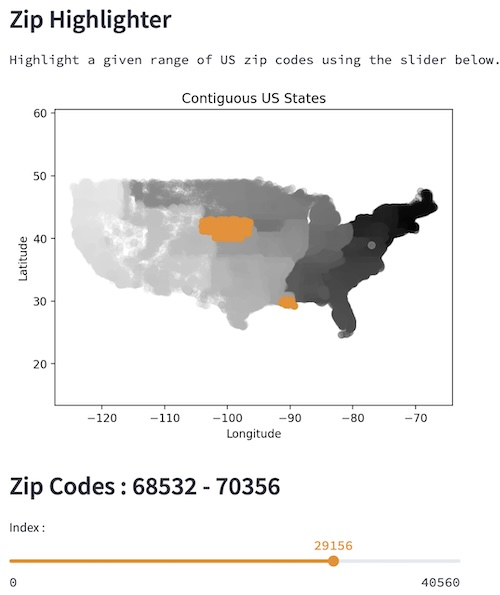

# ZipHighlighter
Interactive zip code range selection for the US Contiguous States.

[ziphighlighter.streamlit.app](https://ziphighlighter.streamlit.app)

---

[](https://ziphighlighter.streamlit.app)

---

Valid zip codes (to format ``` '.1f' ```) using [pgeocode](https://pypi.org/project/pgeocode/).

Interface with ~80 lines if Python using [streamlit](https://streamlit.io).


