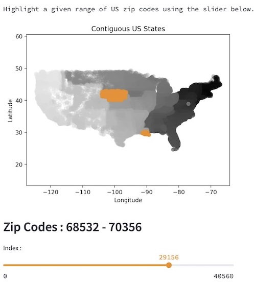

# ZipHighlighter
Interactive zip code range selection for the US Contiguous States.

* [ziphighlighter.streamlit.app](https://ziphighlighter.streamlit.app)
* [about](https://numanticsolutions.com/#ziphighlighter)
* [comments / questions/](https://www.linkedin.com/feed/update/urn:li:share:7244909595695980544/?actorCompanyId=104756822)

---

[](https://ziphighlighter.streamlit.app)

---

The valid zip codes (with format ``` '.1f' ```) were generated using [pgeocode](https://pypi.org/project/pgeocode/).

Core interface implemented with ~80 lines of Python using [streamlit](https://streamlit.io).


